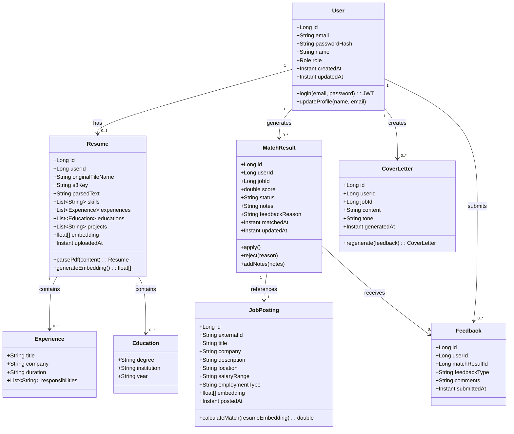

# MASTER ARCHITECT: PHASE 1 PRODUCTION SPECIFICATION (COMPLETE)
**Project**: AutoHire-Flow – AI Career Co-Pilot (Backend Only)  
**Phase**: Phase 1 (0-10k users)  
**Platform**: Web (React) – Backend focus  
**Language**: Java 17 + Spring Boot 3.x  
**Architecture**: Clean Architecture (Monolithic)  
**AI Stack**: Ollama (Local/Free) + LangChain4j

---

## 1. SDLC: Requirements & Scope

### Functional Requirements (Phase 1 Enabled Features)

| ID | Feature | Description | Acceptance Criteria |
|----|---------|-------------|---------------------|
| FR-01 | User Registration | Email + password signup with validation | User can create account; password BCrypt-hashed; email unique |
| FR-02 | User Login | JWT-based authentication | Valid credentials return JWT token (24h expiry) |
| FR-03 | Profile Management | View and update user profile | Name, email updatable; password change flow |
| FR-04 | Resume Upload | PDF upload with AI parsing | Extract: skills, experience, education, projects; store parsed text + embeddings |
| FR-05 | Resume Storage | Vector embedding storage | Store 1536-dim embedding (nomic-embed-text) in pgvector |
| FR-06 | Job Search | Basic filters (title, location, experience) | Returns paginated job listings from internal DB |
| FR-07 | Dynamic Matching | Semantic similarity scoring (0-100%) | Cosine similarity between resume + job embeddings |
| FR-08 | Match Viewing | List matched jobs with scores | Sort by match %; filter by status |
| FR-09 | Cover Letter Generation | Tailored cover letter for selected job | 3-paragraph format; includes company/job details |
| FR-10 | Application Tracking | Manual status tracking | Status: PENDING → APPLIED/REJECTED/INTERVIEW; notes field |
| FR-11 | Feedback Loop | Reject matches with reason | Reasons: TOO_SENIOR, NOT_INTERESTED, SALARY_LOW, OTHER; influences future scoring |

### Non-Functional Requirements (KPIs) for 0-10k Users

| NFR | Metric | Target | Measurement |
|-----|--------|--------|-------------|
| NFR-01 | API Latency (P95) | < 300ms for core endpoints | Prometheus + Micrometer |
| NFR-02 | API Latency (P95) - AI Heavy | < 3s for matching/cover letter | Prometheus + Micrometer |
| NFR-03 | Availability | 99.9% uptime | Health checks + monitoring |
| NFR-04 | Throughput | 50 concurrent requests | Load testing (k6) |
| NFR-05 | Active Sessions | 500-1000 concurrent users | Session tracking |
| NFR-06 | Data Durability | 99.99% | PostgreSQL WAL archiving |
| NFR-07 | Security | All sensitive data encrypted at rest + in transit | TLS 1.3; AES-256 for DB |
| NFR-08 | AI Response Time | < 5s for embedding generation | Ollama local inference |
| NFR-09 | Storage | 10GB for PostgreSQL; 50GB for S3 (resumes) | Cloud storage metrics |

---

## 2. SDLC: Architecture & Scaling Roadmap (Phase-Locked)

### Phase-Specific HLD

The system follows **Clean Architecture** in a single monolithic Spring Boot application. This structure is ideal for Phase 1 (0-10k users) because it:
- Minimizes operational complexity
- Enables fast development velocity
- Simplifies debugging with single artifact
- Maintains clear separation of concerns for future microservices migration
- Allows local AI inference via Ollama (zero API costs)

### Context Diagram

```mermaid
flowchart TD
    subgraph External["External Actors"]
        User[("Web User\n(React Frontend)")]
        Admin[("System Admin")]
    end
    
    subgraph CDN["CDN / Edge"]
        CloudFront[CloudFront / Nginx\nStatic Assets]
    end
    
    subgraph Backend["AutoHire-Flow Backend"]
        LB[("Load Balancer\nNginx / ALB")]
        
        subgraph AppCluster["Application Layer"]
            App1[Spring Boot\nApp Instance 1]
            App2[Spring Boot\nApp Instance 2]
        end
        
        subgraph Data["Data Layer"]
            PG[(PostgreSQL 16\n+ pgvector)]
            Redis[(Redis 7\nCache + Rate Limiting)]
            S3[("S3 / MinIO\nResume Storage")]
        end
        
        subgraph AI["AI Layer"]
            Ollama[Ollama Server\nnomic-embed-text\nmistral/llama3.2]
        end
    end
    
    subgraph ExternalServices["External Services"]
        JobBoards[Job Boards API\n(Indeed, LinkedIn, etc)]
    end
    
    User --> CloudFront
    CloudFront --> LB
    Admin --> LB
    LB --> App1
    LB --> App2
    App1 <--> PG
    App2 <--> PG
    App1 <--> Redis
    App2 <--> Redis
    App1 <--> S3
    App2 <--> S3
    App1 <--> Ollama
    App2 <--> Ollama
    App1 <--> JobBoards
    App2 <--> JobBoards
```

### Text-Level Description

**Entry Point**: React frontend communicates via HTTPS through CloudFront CDN → Nginx load balancer. All static assets served from CDN; API requests routed to Spring Boot cluster.

**Application Layer**: Spring Boot monolith (2-3 instances behind load balancer) handles all business logic. Each instance is stateless with sessions stored in Redis.

**Data Layer**:
- **PostgreSQL 16 + pgvector**: Primary database with vector similarity search
- **Redis**: Session store, rate limiting cache, match result cache (TTL 15min)
- **S3/MinIO**: Raw resume PDF storage (for audit/compliance)

**AI Layer**: Local Ollama server running:
- **nomic-embed-text**: 768-dim embeddings (free, no API costs)
- **mistral / llama3.2**: Text generation for parsing + cover letters

**External Integration**: REST clients to job boards (synchronous in Phase 1)

**Security Boundaries**:
- All traffic encrypted with TLS 1.3
- JWT authentication at API gateway level
- VPC isolation for database tier

---

## 3. SDLC: Low-Level Design (LLD)

### Complete Domain Model



### Complete Repository Pattern Implementation

```java
// Domain Port (Application Layer)
public interface ResumePort {
    Resume findByUserId(Long userId);
    Resume save(Resume resume);
    void delete(Long resumeId);
    Optional<Resume> findById(Long id);
    boolean existsByUserId(Long userId);
}

// Infrastructure Implementation
@Repository
public class ResumeRepositoryImpl implements ResumePort {
    
    private final JpaResumeRepository jpaRepository;
    private final ResumeMapper mapper;
    
    @Override
    @Transactional
    public Resume save(Resume resume) {
        // Convert domain to JPA entity
        ResumeEntity entity = mapper.toEntity(resume);
        
        // Save with vector using pgvector
        ResumeEntity saved = jpaRepository.save(entity);
        
        // Return domain object
        return mapper.toDomain(saved);
    }
    
    @Override
    public Resume findByUserId(Long userId) {
        return jpaRepository.findByUserId(userId)
            .map(mapper::toDomain)
            .orElseThrow(() -> new ResumeNotFoundException(userId));
    }
}
```

### Complete Factory Pattern Implementation

```java
// Domain Factory for AI Services
@Component
public class AiServiceFactory {
    
    private final Map<AiServiceType, AiService> services = new HashMap<>();
    
    @PostConstruct
    public void init() {
        services.put(AiServiceType.PARSER, new OllamaResumeParser());
        services.put(AiServiceType.EMBEDDER, new OllamaEmbeddingService());
        services.put(AiServiceType.MATCHER, new SemanticMatcher());
        services.put(AiServiceType.COVER_LETTER, new OllamaCoverLetterGenerator());
    }
    
    public AiService getService(AiServiceType type) {
        return Optional.ofNullable(services.get(type))
            .orElseThrow(() -> new AiServiceNotFoundException(type));
    }
    
    public ResumeParser createParser(FileType fileType) {
        return switch(fileType) {
            case PDF -> new PdfResumeParser(getService(AiServiceType.PARSER));
            case DOCX -> new DocxResumeParser(getService(AiServiceType.PARSER));
            default -> throw new UnsupportedFileTypeException(fileType);
        };
    }
}
```

### Complete Strategy Pattern Implementation

```java
// Matching Strategy Interface
public interface MatchStrategy {
    MatchScore calculate(ResumeEmbedding resume, JobEmbedding job);
    String getStrategyName();
    int getPriority();
}

// Semantic Matching Strategy
@Component
@Primary
public class SemanticMatchStrategy implements MatchStrategy {
    
    private final EmbeddingService embeddingService;
    
    @Override
    public MatchScore calculate(ResumeEmbedding resume, JobEmbedding job) {
        double similarity = cosineSimilarity(
            resume.getVector(), 
            job.getVector()
        );
        
        double weightedScore = similarity * 100;
        
        // Apply bonus for keyword overlaps
        double keywordBonus = calculateKeywordOverlap(resume, job);
        
        return MatchScore.builder()
            .score(Math.min(100, weightedScore + keywordBonus))
            .strategy(getStrategyName())
            .confidence(similarity)
            .build();
    }
    
    private double cosineSimilarity(float[] a, float[] b) {
        double dotProduct = 0.0;
        double normA = 0.0;
        double normB = 0.0;
        
        for (int i = 0; i < a.length; i++) {
            dotProduct += a[i] * b[i];
            normA += Math.pow(a[i], 2);
            normB += Math.pow(b[i], 2);
        }
        
        return dotProduct / (Math.sqrt(normA) * Math.sqrt(normB));
    }
}

// Context class that uses strategy
@Component
public class MatchEngine {
    
    private final List<MatchStrategy> strategies;
    
    @Autowired
    public MatchEngine(List<MatchStrategy> strategies) {
        this.strategies = strategies.stream()
            .sorted(Comparator.comparing(MatchStrategy::getPriority).reversed())
            .collect(Collectors.toList());
    }
    
    public MatchScore evaluate(Resume resume, JobPosting job) {
        ResumeEmbedding resumeEmbed = resume.getEmbedding();
        JobEmbedding jobEmbed = job.getEmbedding();
        
        // Try strategies in priority order
        for (MatchStrategy strategy : strategies) {
            MatchScore score = strategy.calculate(resumeEmbed, jobEmbed);
            if (score.getConfidence() > 0.7) {
                return score;
            }
        }
        
        // Fallback to basic similarity
        return strategies.get(strategies.size() - 1).calculate(resumeEmbed, jobEmbed);
    }
}
```

### Complete Use Case Implementation

```java
// Upload Resume Use Case
@Component
public class UploadResumeUseCase implements UseCase<UploadResumeCommand, UploadResumeResult> {
    
    private final ResumePort resumePort;
    private final FileStoragePort fileStoragePort;
    private final AiServiceFactory aiFactory;
    private final ResumeParserFactory parserFactory;
    private final EmbeddingService embeddingService;
    
    @Override
    @Transactional
    public UploadResumeResult execute(UploadResumeCommand command) {
        // 1. Validate file
        validateFile(command.getFile());
        
        // 2. Store raw file in S3
        String s3Key = fileStoragePort.store(command.getFile(), command.getUserId());
        
        // 3. Parse resume with Ollama
        ResumeParser parser = parserFactory.createParser(command.getFile().getContentType());
        ParsedResumeData parsed = parser.parse(command.getFile());
        
        // 4. Generate embedding using Ollama
        float[] embedding = embeddingService.embed(parsed.getFullText());
        
        // 5. Create domain entity
        Resume resume = Resume.builder()
            .userId(command.getUserId())
            .originalFileName(command.getFile().getOriginalFilename())
            .s3Key(s3Key)
            .parsedText(parsed.getFullText())
            .skills(parsed.getSkills())
            .experiences(parsed.getExperiences())
            .educations(parsed.getEducations())
            .projects(parsed.getProjects())
            .embedding(embedding)
            .uploadedAt(Instant.now())
            .build();
        
        // 6. Save to database
        Resume saved = resumePort.save(resume);
        
        // 7. Return result
        return UploadResumeResult.builder()
            .resumeId(saved.getId())
            .parsedSkillsCount(saved.getSkills().size())
            .status(ProcessingStatus.SUCCESS)
            .extractedSkills(saved.getSkills())
            .build();
    }
    
    private void validateFile(MultipartFile file) {
        if (file.isEmpty()) {
            throw new EmptyFileException();
        }
        if (file.getSize() > 5 * 1024 * 1024) {
            throw new FileTooLargeException(5);
        }
        if (!"application/pdf".equals(file.getContentType())) {
            throw new InvalidFileTypeException("Only PDF files are supported");
        }
    }
}

// Calculate Match Use Case
@Component
public class CalculateMatchUseCase implements UseCase<MatchCommand, MatchResult> {
    
    private final ResumePort resumePort;
    private final JobPostingPort jobPostingPort;
    private final MatchResultPort matchResultPort;
    private final MatchEngine matchEngine;
    private final CacheService cacheService;
    
    @Override
    @Transactional
    public MatchResult execute(MatchCommand command) {
        // 1. Check cache first
        String cacheKey = String.format("match:%d:%d", command.getUserId(), command.getJobId());
        Optional<MatchResult> cached = cacheService.get(cacheKey, MatchResult.class);
        if (cached.isPresent()) {
            return cached.get();
        }
        
        // 2. Load entities
        Resume resume = resumePort.findByUserId(command.getUserId());
        if (resume == null) {
            throw new ResumeNotFoundException(command.getUserId());
        }
        
        JobPosting job = jobPostingPort.findById(command.getJobId())
            .orElseThrow(() -> new JobNotFoundException(command.getJobId()));
        
        // 3. Calculate match score
        MatchScore score = matchEngine.evaluate(resume, job);
        
        // 4. Create or update match result
        MatchResult result = matchResultPort.findByUserAndJob(command.getUserId(), command.getJobId())
            .orElse(new MatchResult());
        
        result.setUserId(command.getUserId());
        result.setJobId(command.getJobId());
        result.setScore(score.getScore());
        result.setStatus(MatchStatus.PENDING);
        result.setMatchedAt(Instant.now());
        
        MatchResult saved = matchResultPort.save(result);
        
        // 5. Cache result
        cacheService.set(cacheKey, saved, Duration.ofMinutes(15));
        
        return saved;
    }
}
```

### Complete Design Principles Implementation

**SOLID Applied**:

1. **Single Responsibility**:
```java
// Each service has ONE reason to change
@Service
public class ResumeParserService { /* Only parsing logic */ }

@Service
public class EmbeddingService { /* Only embedding generation */ }

@Service
public class MatchScoreCalculator { /* Only scoring logic */ }
```

2. **Open/Closed**:
```java
// Open for extension, closed for modification
public interface MatchStrategy { /* Can add new strategies without changing existing */ }

// Adding new strategy:
@Component
public class KeywordMatchStrategy implements MatchStrategy { /* New behavior */ }
```

3. **Liskov Substitution**:
```java
// All parsers can substitute base type
public interface ResumeParser {
    ParsedResumeData parse(MultipartFile file);
}

public class PdfResumeParser implements ResumeParser { /* */ }
public class DocxResumeParser implements ResumeParser { /* */ }
```

4. **Interface Segregation**:
```java
// Split into focused interfaces
public interface ResumeReader { /* */ }
public interface ResumeParser { /* */ }
public interface ResumeValidator { /* */ }
public interface ResumeStorage { /* */ }
```

5. **Dependency Inversion**:
```java
// Depend on abstractions, not concretions
@Service
public class UploadResumeUseCase {
    private final ResumePort resumePort; // Abstract interface
    private final FileStoragePort fileStoragePort; // Abstract interface
    
    // Not: private final JpaResumeRepository jpaRepository;
}
```

---

## 4. SDLC: Data, Messaging & Configuration

### Complete Schema Design with PostgreSQL + pgvector

```sql
-- Enable vector extension
CREATE EXTENSION IF NOT EXISTS vector;

-- Users table
CREATE TABLE users (
    id BIGSERIAL PRIMARY KEY,
    email VARCHAR(255) UNIQUE NOT NULL,
    password_hash VARCHAR(255) NOT NULL,
    name VARCHAR(100) NOT NULL,
    role VARCHAR(20) DEFAULT 'USER',
    is_active BOOLEAN DEFAULT true,
    last_login TIMESTAMP,
    created_at TIMESTAMP DEFAULT CURRENT_TIMESTAMP,
    updated_at TIMESTAMP DEFAULT CURRENT_TIMESTAMP
);

CREATE INDEX idx_users_email ON users(email);
CREATE INDEX idx_users_role ON users(role);

-- Resumes table with vector embedding
CREATE TABLE resumes (
    id BIGSERIAL PRIMARY KEY,
    user_id BIGINT NOT NULL REFERENCES users(id) ON DELETE CASCADE,
    original_filename VARCHAR(255) NOT NULL,
    s3_key VARCHAR(500) NOT NULL,
    parsed_text TEXT,
    skills JSONB DEFAULT '[]',
    experiences JSONB DEFAULT '[]',
    educations JSONB DEFAULT '[]',
    projects JSONB DEFAULT '[]',
    embedding vector(768),  -- nomic-embed-text dimension
    uploaded_at TIMESTAMP DEFAULT CURRENT_TIMESTAMP,
    updated_at TIMESTAMP DEFAULT CURRENT_TIMESTAMP
);

-- HNSW index for fast similarity search
CREATE INDEX idx_resumes_embedding ON resumes 
USING hnsw (embedding vector_cosine_ops);

CREATE INDEX idx_resumes_user_id ON resumes(user_id);

-- Job postings table
CREATE TABLE job_postings (
    id BIGSERIAL PRIMARY KEY,
    external_id VARCHAR(255),
    title VARCHAR(255) NOT NULL,
    company VARCHAR(255) NOT NULL,
    description TEXT NOT NULL,
    location VARCHAR(255),
    salary_range VARCHAR(100),
    employment_type VARCHAR(50),
    embedding vector(768),
    source VARCHAR(50),
    posted_at TIMESTAMP,
    expires_at TIMESTAMP,
    created_at TIMESTAMP DEFAULT CURRENT_TIMESTAMP
);

CREATE INDEX idx_jobs_title ON job_postings(title);
CREATE INDEX idx_jobs_company ON job_postings(company);
CREATE INDEX idx_jobs_embedding ON job_postings 
USING hnsw (embedding vector_cosine_ops);

-- Match results table
CREATE TABLE match_results (
    id BIGSERIAL PRIMARY KEY,
    user_id BIGINT NOT NULL REFERENCES users(id) ON DELETE CASCADE,
    job_id BIGINT NOT NULL REFERENCES job_postings(id) ON DELETE CASCADE,
    score DECIMAL(5,2) CHECK (score >= 0 AND score <= 100),
    status VARCHAR(20) DEFAULT 'PENDING',
    notes TEXT,
    feedback_reason VARCHAR(50),
    matched_at TIMESTAMP DEFAULT CURRENT_TIMESTAMP,
    updated_at TIMESTAMP DEFAULT CURRENT_TIMESTAMP,
    UNIQUE(user_id, job_id)
);

CREATE INDEX idx_matches_user_id ON match_results(user_id);
CREATE INDEX idx_matches_status ON match_results(status);
CREATE INDEX idx_matches_score ON match_results(score DESC);

-- Cover letters table
CREATE TABLE cover_letters (
    id BIGSERIAL PRIMARY KEY,
    user_id BIGINT NOT NULL REFERENCES users(id) ON DELETE CASCADE,
    job_id BIGINT NOT NULL REFERENCES job_postings(id) ON DELETE CASCADE,
    content TEXT NOT NULL,
    tone VARCHAR(20) DEFAULT 'PROFESSIONAL',
    generated_at TIMESTAMP DEFAULT CURRENT_TIMESTAMP,
    UNIQUE(user_id, job_id)
);

-- Feedback table
CREATE TABLE feedback (
    id BIGSERIAL PRIMARY KEY,
    user_id BIGINT NOT NULL REFERENCES users(id) ON DELETE CASCADE,
    match_result_id BIGINT NOT NULL REFERENCES match_results(id) ON DELETE CASCADE,
    feedback_type VARCHAR(50) NOT NULL,
    comments TEXT,
    submitted_at TIMESTAMP DEFAULT CURRENT_TIMESTAMP
);

-- Application tracking
CREATE TABLE applications (
    id BIGSERIAL PRIMARY KEY,
    user_id BIGINT NOT NULL REFERENCES users(id) ON DELETE CASCADE,
    job_id BIGINT NOT NULL REFERENCES job_postings(id) ON DELETE CASCADE,
    status VARCHAR(20) NOT NULL,
    applied_at TIMESTAMP,
    notes TEXT,
    created_at TIMESTAMP DEFAULT CURRENT_TIMESTAMP,
    updated_at TIMESTAMP DEFAULT CURRENT_TIMESTAMP
);

CREATE INDEX idx_applications_user_status ON applications(user_id, status);

-- Audit log for compliance
CREATE TABLE audit_log (
    id BIGSERIAL PRIMARY KEY,
    user_id BIGINT REFERENCES users(id),
    action VARCHAR(100) NOT NULL,
    entity_type VARCHAR(50),
    entity_id BIGINT,
    old_value JSONB,
    new_value JSONB,
    ip_address INET,
    user_agent TEXT,
    created_at TIMESTAMP DEFAULT CURRENT_TIMESTAMP
);

-- Create triggers for updated_at
CREATE OR REPLACE FUNCTION update_updated_at_column()
RETURNS TRIGGER AS $$
BEGIN
    NEW.updated_at = CURRENT_TIMESTAMP;
    RETURN NEW;
END;
$$ language 'plpgsql';

CREATE TRIGGER update_users_updated_at BEFORE UPDATE ON users
    FOR EACH ROW EXECUTE FUNCTION update_updated_at_column();
    
CREATE TRIGGER update_resumes_updated_at BEFORE UPDATE ON resumes
    FOR EACH ROW EXECUTE FUNCTION update_updated_at_column();
```

### Complete Redis Configuration

```yaml
# Redis configuration for caching and rate limiting
spring:
  data:
    redis:
      host: ${REDIS_HOST:localhost}
      port: ${REDIS_PORT:6379}
      password: ${REDIS_PASSWORD:}
      timeout: 5000ms
      lettuce:
        pool:
          max-active: 20
          max-idle: 10
          min-idle: 5

# Cache configuration
caching:
  match-results:
    ttl: 900  # 15 minutes
    max-size: 10000
  job-listings:
    ttl: 3600  # 1 hour
    max-size: 5000
  user-sessions:
    ttl: 86400  # 24 hours
```

### Complete Application Configuration

```yaml
# application-prod.yml
spring:
  datasource:
    url: jdbc:postgresql://${DB_HOST}:${DB_PORT}/${DB_NAME}
    username: ${DB_USERNAME}
    password: ${DB_PASSWORD}
    hikari:
      maximum-pool-size: 20
      minimum-idle: 5
      connection-timeout: 30000
      idle-timeout: 600000
      max-lifetime: 1800000
  
  jpa:
    hibernate:
      ddl-auto: validate
    properties:
      hibernate:
        dialect: org.hibernate.dialect.PostgreSQLDialect
        jdbc:
          batch_size: 20
        order_inserts: true
        order_updates: true
  
  servlet:
    multipart:
      max-file-size: 5MB
      max-request-size: 5MB

# Ollama configuration
ollama:
  base-url: ${OLLAMA_URL:http://localhost:11434}
  embedding-model: nomic-embed-text
  chat-model: mistral  # or llama3.2 for better quality
  timeout: 30000
  max-retries: 3

# Security
jwt:
  secret: ${JWT_SECRET:default-secret-change-in-production}
  expiration: 86400000  # 24 hours in ms

# Rate limiting
rate-limiting:
  enabled: true
  default-limit: 100
  ai-endpoints-limit: 30
  duration-minutes: 1

# Monitoring
management:
  endpoints:
    web:
      exposure:
        include: health,metrics,prometheus
  metrics:
    export:
      prometheus:
        enabled: true
```

---

## 5. SDLC: API & State Management - Complete REST Contract

### Complete REST API Specification

```yaml
openapi: 3.0.3
info:
  title: AutoHire-Flow API
  version: 1.0.0
  description: AI Career Co-Pilot Backend API

servers:
  - url: https://api.autohire-flow.com/v1
    description: Production Server

components:
  securitySchemes:
    bearerAuth:
      type: http
      scheme: bearer
      bearerFormat: JWT
  
  schemas:
    ErrorResponse:
      type: object
      properties:
        errorCode:
          type: string
        message:
          type: string
        timestamp:
          type: string
          format: date-time
        details:
          type: object
    
    UserResponse:
      type: object
      properties:
        userId:
          type: integer
          format: int64
        email:
          type: string
        name:
          type: string
        hasResume:
          type: boolean
    
    ResumeUploadResponse:
      type: object
      properties:
        resumeId:
          type: integer
          format: int64
        parsedSkillsCount:
          type: integer
        status:
          type: string
          enum: [SUCCESS, PARTIAL, FAILED]
        extractedSkills:
          type: array
          items:
            type: string
    
    MatchScoreResponse:
      type: object
      properties:
        matchScore:
          type: number
          format: double
          minimum: 0
          maximum: 100
        keyMatchingSkills:
          type: array
          items:
            type: string
        missingSkills:
          type: array
          items:
            type: string
        explanation:
          type: string
    
    CoverLetterResponse:
      type: object
      properties:
        coverLetter:
          type: string
        generatedAt:
          type: string
          format: date-time
        wordCount:
          type: integer
    
    ApplicationTrackRequest:
      type: object
      required:
        - jobId
        - status
      properties:
        jobId:
          type: integer
          format: int64
        status:
          type: string
          enum: [APPLIED, REJECTED, INTERVIEW]
        notes:
          type: string
          maxLength: 500

security:
  - bearerAuth: []

paths:
  /auth/register:
    post:
      summary: Register new user
      tags: [Authentication]
      requestBody:
        required: true
        content:
          application/json:
            schema:
              type: object
              required: [email, password, name]
              properties:
                email:
                  type: string
                  format: email
                password:
                  type: string
                  minLength: 8
                name:
                  type: string
                  minLength: 2
      responses:
        201:
          description: User registered successfully
          content:
            application/json:
              schema:
                type: object
                properties:
                  userId:
                    type: integer
                    format: int64
                  email:
                    type: string
                  token:
                    type: string
                  name:
                    type: string
        400:
          description: Validation error
          content:
            application/json:
              schema:
                $ref: '#/components/schemas/ErrorResponse'
        409:
          description: Email already exists

  /auth/login:
    post:
      summary: Login user
      tags: [Authentication]
      requestBody:
        required: true
        content:
          application/json:
            schema:
              type: object
              required: [email, password]
              properties:
                email:
                  type: string
                  format: email
                password:
                  type: string
      responses:
        200:
          description: Login successful
          content:
            application/json:
              schema:
                type: object
                properties:
                  userId:
                    type: integer
                  token:
                    type: string
                  name:
                    type: string
        401:
          description: Invalid credentials

  /resume/upload:
    post:
      summary: Upload and parse resume
      tags: [Resume]
      security:
        - bearerAuth: []
      requestBody:
        required: true
        content:
          multipart/form-data:
            schema:
              type: object
              properties:
                file:
                  type: string
                  format: binary
                  description: PDF file (max 5MB)
      responses:
        200:
          description: Resume processed
          content:
            application/json:
              schema:
                $ref: '#/components/schemas/ResumeUploadResponse'
        400:
          description: Invalid file
        413:
          description: File too large

  /matcher/score:
    post:
      summary: Calculate match score for a single job
      tags: [Matching]
      security:
        - bearerAuth: []
      requestBody:
        required: true
        content:
          application/json:
            schema:
              type: object
              required: [jobTitle, jobDescription]
              properties:
                jobTitle:
                  type: string
                jobDescription:
                  type: string
                company:
                  type: string
      responses:
        200:
          description: Match score calculated
          content:
            application/json:
              schema:
                $ref: '#/components/schemas/MatchScoreResponse'
        404:
          description: Resume not found

  /matcher/jobs:
    post:
      summary: Search and score multiple jobs
      tags: [Matching]
      security:
        - bearerAuth: []
      requestBody:
        required: true
        content:
          application/json:
            schema:
              type: object
              properties:
                searchQuery:
                  type: string
                location:
                  type: string
                limit:
                  type: integer
                  default: 20
                  maximum: 100
      responses:
        200:
          description: List of scored jobs
          content:
            application/json:
              schema:
                type: array
                items:
                  type: object
                  properties:
                    jobId:
                      type: integer
                    title:
                      type: string
                    company:
                      type: string
                    location:
                      type: string
                    matchScore:
                      type: number
                    status:
                      type: string

  /cover-letter/generate:
    post:
      summary: Generate tailored cover letter
      tags: [CoverLetter]
      security:
        - bearerAuth: []
      requestBody:
        required: true
        content:
          application/json:
            schema:
              type: object
              required: [jobId, jobTitle, company, jobDescription]
              properties:
                jobId:
                  type: integer
                jobTitle:
                  type: string
                company:
                  type: string
                jobDescription:
                  type: string
                tone:
                  type: string
                  enum: [PROFESSIONAL, ENTHUSIASTIC, CONCISE]
                  default: PROFESSIONAL
      responses:
        200:
          description: Cover letter generated
          content:
            application/json:
              schema:
                $ref: '#/components/schemas/CoverLetterResponse'

  /applications/track:
    post:
      summary: Track job application status
      tags: [Applications]
      security:
        - bearerAuth: []
      requestBody:
        required: true
        content:
          application/json:
            schema:
              $ref: '#/components/schemas/ApplicationTrackRequest'
      responses:
        200:
          description: Application tracked
          content:
            application/json:
              schema:
                type: object
                properties:
                  matchResultId:
                    type: integer
                  status:
                    type: string
                  updatedAt:
                    type: string
                    format: date-time

  /feedback/submit:
    post:
      summary: Submit feedback on match
      tags: [Feedback]
      security:
        - bearerAuth: []
      requestBody:
        required: true
        content:
          application/json:
            schema:
              type: object
              required: [matchResultId, reason]
              properties:
                matchResultId:
                  type: integer
                reason:
                  type: string
                  enum: [TOO_SENIOR, NOT_INTERESTED, SALARY_LOW, OTHER]
                comments:
                  type: string
                  maxLength: 500
      responses:
        200:
          description: Feedback recorded
          content:
            application/json:
              schema:
                type: object
                properties:
                  message:
                    type: string
                  feedbackId:
                    type: integer

  /matches:
    get:
      summary: Get user's matches
      tags: [Matching]
      security:
        - bearerAuth: []
      parameters:
        - name: status
          in: query
          schema:
            type: string
            enum: [PENDING, APPLIED, REJECTED, INTERVIEW]
        - name: page
          in: query
          schema:
            type: integer
            default: 0
        - name: size
          in: query
          schema:
            type: integer
            default: 20
        - name: sortBy
          in: query
          schema:
            type: string
            enum: [score, matchedAt]
            default: score
      responses:
        200:
          description: Paginated matches
          content:
            application/json:
              schema:
                type: object
                properties:
                  content:
                    type: array
                    items:
                      $ref: '#/components/schemas/MatchResult'
                  totalElements:
                    type: integer
                  totalPages:
                    type: integer
                  page:
                    type: integer
                  size:
                    type: integer
```

### Complete Global Exception Handler

```java
@RestControllerAdvice
@Slf4j
public class GlobalExceptionHandler {
    
    @ExceptionHandler(ResumeNotFoundException.class)
    @ResponseStatus(HttpStatus.NOT_FOUND)
    public ErrorResponse handleResumeNotFound(ResumeNotFoundException e) {
        log.warn("Resume not found: {}", e.getMessage());
        return ErrorResponse.builder()
            .errorCode("RESUME_NOT_FOUND")
            .message(e.getMessage())
            .timestamp(Instant.now())
            .build();
    }
    
    @ExceptionHandler(FileTooLargeException.class)
    @ResponseStatus(HttpStatus.PAYLOAD_TOO_LARGE)
    public ErrorResponse handleFileTooLarge(FileTooLargeException e) {
        return ErrorResponse.builder()
            .errorCode("FILE_TOO_LARGE")
            .message(e.getMessage())
            .timestamp(Instant.now())
            .build();
    }
    
    @ExceptionHandler(MethodArgumentNotValidException.class)
    @ResponseStatus(HttpStatus.BAD_REQUEST)
    public ErrorResponse handleValidation(MethodArgumentNotValidException e) {
        Map<String, String> errors = e.getBindingResult()
            .getFieldErrors()
            .stream()
            .collect(Collectors.toMap(
                FieldError::getField,
                FieldError::getDefaultMessage,
                (a, b) -> a + ", " + b
            ));
        
        return ErrorResponse.builder()
            .errorCode("VALIDATION_FAILED")
            .message("Invalid request parameters")
            .timestamp(Instant.now())
            .details(errors)
            .build();
    }
    
    @ExceptionHandler(AiServiceException.class)
    @ResponseStatus(HttpStatus.SERVICE_UNAVAILABLE)
    public ErrorResponse handleAiError(AiServiceException e) {
        log.error("AI service error: {}", e.getMessage(), e);
        return ErrorResponse.builder()
            .errorCode("AI_SERVICE_ERROR")
            .message("AI service temporarily unavailable")
            .timestamp(Instant.now())
            .build();
    }
    
    @ExceptionHandler(Exception.class)
    @ResponseStatus(HttpStatus.INTERNAL_SERVER_ERROR)
    public ErrorResponse handleGeneric(Exception e) {
        log.error("Unexpected error", e);
        return ErrorResponse.builder()
            .errorCode("INTERNAL_ERROR")
            .message("An unexpected error occurred")
            .timestamp(Instant.now())
            .build();
    }
}
```

---

## 6. SDLC: DevOps, Infrastructure & Disaster Recovery

### Complete Multi-Stage Dockerfile

```dockerfile
# Stage 1: Build
FROM maven:3.9-eclipse-temurin-17 AS builder

WORKDIR /app

# Copy dependency definitions
COPY pom.xml .
COPY mvnw .
COPY .mvn .mvn

# Download dependencies (cached unless pom.xml changes)
RUN mvn dependency:go-offline

# Copy source code
COPY src src

# Build application
RUN mvn clean package -DskipTests

# Stage 2: Run
FROM eclipse-temurin:17-jre-alpine

# Create non-root user
RUN addgroup -S appgroup && adduser -S appuser -G appgroup

WORKDIR /app

# Install curl for health checks
RUN apk add --no-cache curl

# Copy JAR from builder
COPY --from=builder /app/target/*.jar app.jar

# Create directories for logs and temp files
RUN mkdir -p /app/logs /app/temp && \
    chown -R appuser:appgroup /app

# Switch to non-root user
USER appuser

# Expose application port
EXPOSE 8080

# Health check
HEALTHCHECK --interval=30s --timeout=3s --start-period=60s --retries=3 \
  CMD curl -f http://localhost:8080/actuator/health || exit 1

# Run application
ENTRYPOINT ["java", \
    "-Xms512m", \
    "-Xmx1024m", \
    "-XX:+UseG1GC", \
    "-XX:+UseContainerSupport", \
    "-Djava.security.egd=file:/dev/./urandom", \
    "-jar", "app.jar"]
```

### Complete Docker Compose for Development

```yaml
version: '3.8'

services:
  postgres:
    image: pgvector/pgvector:pg16
    container_name: autohire-postgres
    environment:
      POSTGRES_DB: autohire
      POSTGRES_USER: autohire_user
      POSTGRES_PASSWORD: autohire_pass
      POSTGRES_INITDB_ARGS: "--encoding=UTF-8"
    ports:
      - "5432:5432"
    volumes:
      - postgres_data:/var/lib/postgresql/data
      - ./init-db.sql:/docker-entrypoint-initdb.d/init.sql
    healthcheck:
      test: ["CMD-SHELL", "pg_isready -U autohire_user -d autohire"]
      interval: 10s
      timeout: 5s
      retries: 5

  redis:
    image: redis:7-alpine
    container_name: autohire-redis
    command: redis-server --appendonly yes --requirepass redis_pass
    ports:
      - "6379:6379"
    volumes:
      - redis_data:/data
    healthcheck:
      test: ["CMD", "redis-cli", "ping"]
      interval: 10s
      timeout: 5s
      retries: 5

  ollama:
    image: ollama/ollama:latest
    container_name: autohire-ollama
    ports:
      - "11434:11434"
    volumes:
      - ollama_data:/root/.ollama
    environment:
      - OLLAMA_HOST=0.0.0.0
    healthcheck:
      test: ["CMD", "curl", "-f", "http://localhost:11434/api/tags"]
      interval: 30s
      timeout: 10s
      retries: 3
    deploy:
      resources:
        reservations:
          devices:
            - driver: nvidia
              count: all
              capabilities: [gpu]

  app:
    build: .
    container_name: autohire-app
    ports:
      - "8080:8080"
    environment:
      SPRING_PROFILES_ACTIVE: dev
      DB_HOST: postgres
      DB_PORT: 5432
      DB_NAME: autohire
      DB_USERNAME: autohire_user
      DB_PASSWORD: autohire_pass
      REDIS_HOST: redis
      REDIS_PORT: 6379
      REDIS_PASSWORD: redis_pass
      OLLAMA_URL: http://ollama:11434
      JWT_SECRET: dev-secret-key-change-in-production
    depends_on:
      postgres:
        condition: service_healthy
      redis:
        condition: service_healthy
      ollama:
        condition: service_healthy
    volumes:
      - ./logs:/app/logs

volumes:
  postgres_data:
  redis_data:
  ollama_data:
```

### Complete CI/CD Pipeline (GitHub Actions)

```yaml
name: CI/CD Pipeline

on:
  push:
    branches: [main, develop]
  pull_request:
    branches: [main]

env:
  REGISTRY: ghcr.io
  IMAGE_NAME: ${{ github.repository }}

jobs:
  test:
    runs-on: ubuntu-latest
    services:
      postgres:
        image: pgvector/pgvector:pg16
        env:
          POSTGRES_DB: autohire_test
          POSTGRES_USER: test_user
          POSTGRES_PASSWORD: test_pass
        ports:
          - 5432:5432
        options: >-
          --health-cmd pg_isready
          --health-interval 10s
          --health-timeout 5s
          --health-retries 5
      
      redis:
        image: redis:7-alpine
        ports:
          - 6379:6379
        options: >-
          --health-cmd "redis-cli ping"
          --health-interval 10s
          --health-timeout 5s
          --health-retries 5

    steps:
      - uses: actions/checkout@v3
      
      - name: Set up JDK 17
        uses: actions/setup-java@v3
        with:
          java-version: '17'
          distribution: 'temurin'
          cache: maven
      
      - name: Cache Maven dependencies
        uses: actions/cache@v3
        with:
          path: ~/.m2
          key: ${{ runner.os }}-m2-${{ hashFiles('**/pom.xml') }}
          restore-keys: ${{ runner.os }}-m2
      
      - name: Run tests
        run: mvn clean test
        env:
          DB_HOST: localhost
          DB_PORT: 5432
          DB_NAME: autohire_test
          DB_USERNAME: test_user
          DB_PASSWORD: test_pass
          REDIS_HOST: localhost
          REDIS_PORT: 6379
      
      - name: Upload test reports
        uses: actions/upload-artifact@v3
        if: always()
        with:
          name: test-reports
          path: target/surefire-reports/
      
      - name: SonarQube Scan
        run: mvn sonar:sonar
        env:
          SONAR_TOKEN: ${{ secrets.SONAR_TOKEN }}
        continue-on-error: true

  build:
    needs: test
    runs-on: ubuntu-latest
    if: github.event_name == 'push' && github.ref == 'refs/heads/main'
    
    steps:
      - uses: actions/checkout@v3
      
      - name: Set up JDK 17
        uses: actions/setup-java@v3
        with:
          java-version: '17'
          distribution: 'temurin'
      
      - name: Build with Maven
        run: mvn clean package -DskipTests
      
      - name: Log in to Container Registry
        uses: docker/login-action@v2
        with:
          registry: ${{ env.REGISTRY }}
          username: ${{ github.actor }}
          password: ${{ secrets.GITHUB_TOKEN }}
      
      - name: Build and push Docker image
        uses: docker/build-push-action@v4
        with:
          context: .
          push: true
          tags: |
            ${{ env.REGISTRY }}/${{ env.IMAGE_NAME }}:latest
            ${{ env.REGISTRY }}/${{ env.IMAGE_NAME }}:${{ github.sha }}
      
      - name: Deploy to staging
        run: |
          echo "Deploying to staging environment..."
          # Add your deployment script here
          # Example: kubectl set image deployment/autohire-flow app=${{ env.REGISTRY }}/${{ env.IMAGE_NAME }}:${{ github.sha }} -n staging
```

### Complete Disaster Recovery Plan

```yaml
# Backup Configuration
backup:
  strategy:
    full_backup: "Daily at 02:00 UTC"
    wal_archive: "Continuous (every 15 min)"
    retention:
      daily: 7
      weekly: 4
      monthly: 3
  
  destinations:
    primary: "s3://autohire-backups/prod/"
    replication: "s3://autohire-backups-dr/prod/"
  
  scripts:
    backup_db: |
      #!/bin/bash
      BACKUP_NAME="autohire_$(date +%Y%m%d_%H%M%S)"
      pg_dump -h $DB_HOST -U $DB_USER $DB_NAME | gzip > /backups/$BACKUP_NAME.sql.gz
      aws s3 cp /backups/$BACKUP_NAME.sql.gz s3://autohire-backups/prod/
      
    backup_wal: |
      #!/bin/bash
      # PostgreSQL continuous archiving
      archive_command="test ! -f /wal_archive/%f && cp %p /wal_archive/%f"
      aws s3 sync /wal_archive/ s3://autohire-backups-prod/wal/

# Recovery Procedure
recovery:
  rto: "4 hours"
  rpo: "1 hour"
  
  steps:
    1_detect_failure:
      - "Monitor health checks failing"
      - "Check database connectivity"
      - "Verify backup availability"
    
    2_initiate_recovery:
      - "Provision new PostgreSQL instance"
      - "Restore latest full backup"
      - "Apply WAL archives"
      - "Verify data integrity"
    
    3_restore_services:
      - "Update application connection strings"
      - "Restart application instances"
      - "Verify all endpoints"
      - "Monitor for 30 minutes"

# Runbooks
runbooks:
  database_corruption:
    description: "Steps to recover from database corruption"
    steps:
      - "Stop application traffic"
      - "Take current database snapshot"
      - "Restore from last known good backup"
      - "Apply WAL up to corruption point"
      - "Verify with integrity checks"
  
  region_failure:
    description: "Cross-region failover"
    steps:
      - "Switch DNS to DR region"
      - "Promote DR database replica"
      - "Scale application in DR region"
      - "Verify all services"
```

---

## 7. SDLC: Testing, Observability & Compliance

### Complete Testing Strategy

```java
// Unit Test Example
@ExtendWith(MockitoExtension.class)
class MatchScoreCalculatorTest {
    
    @Mock
    private EmbeddingService embeddingService;
    
    @InjectMocks
    private MatchScoreCalculator calculator;
    
    @Test
    void shouldCalculateMatchScoreCorrectly() {
        // Given
        float[] resumeEmbed = new float[768];
        float[] jobEmbed = new float[768];
        
        when(embeddingService.embed(anyString())).thenReturn(jobEmbed);
        
        Resume resume = Resume.builder()
            .embedding(resumeEmbed)
            .skills(List.of("Java", "Spring Boot"))
            .build();
        
        JobPosting job = JobPosting.builder()
            .description("Looking for Java Spring developer")
            .build();
        
        // When
        MatchScore score = calculator.calculate(resume, job);
        
        // Then
        assertThat(score.getScore()).isBetween(0.0, 100.0);
        assertThat(score.getKeyMatchingSkills()).contains("Java");
    }
}

// Integration Test with Testcontainers
@SpringBootTest
@Testcontainers
class ResumeUploadIntegrationTest {
    
    @Container
    static PostgreSQLContainer<?> postgres = new PostgreSQLContainer<>("pgvector/pgvector:pg16")
        .withDatabaseName("testdb")
        .withUsername("test")
        .withPassword("test");
    
    @Container
    static GenericContainer<?> redis = new GenericContainer<>("redis:7-alpine")
        .withExposedPorts(6379);
    
    @Container
    static GenericContainer<?> ollama = new GenericContainer<>("ollama/ollama:latest")
        .withExposedPorts(11434);
    
    @Autowired
    private TestRestTemplate restTemplate;
    
    @Test
    void shouldUploadAndParseResume() {
        // Given
        String jwt = authenticateUser();
        
        Resource file = new ClassPathResource("sample-resume.pdf");
        
        MultiValueMap<String, Object> body = new LinkedMultiValueMap<>();
        body.add("file", file);
        
        HttpHeaders headers = new HttpHeaders();
        headers.setBearerAuth(jwt);
        headers.setContentType(MediaType.MULTIPART_FORM_DATA);
        
        HttpEntity<MultiValueMap<String, Object>> request = 
            new HttpEntity<>(body, headers);
        
        // When
        ResponseEntity<ResumeUploadResponse> response = restTemplate.exchange(
            "/api/v1/resume/upload",
            HttpMethod.POST,
            request,
            ResumeUploadResponse.class
        );
        
        // Then
        assertThat(response.getStatusCode()).isEqualTo(HttpStatus.OK);
        assertThat(response.getBody().getStatus()).isEqualTo("SUCCESS");
        assertThat(response.getBody().getParsedSkillsCount()).isGreaterThan(0);
    }
}

// Performance Test (k6 script)
import http from 'k6/http';
import { check, sleep } from 'k6';

export const options = {
    stages: [
        { duration: '1m', target: 20 },  // Ramp up
        { duration: '2m', target: 50 },  // Steady state
        { duration: '1m', target: 0 },   // Ramp down
    ],
    thresholds: {
        http_req_duration: ['p(95)<300'],  // 95% of requests < 300ms
        http_req_failed: ['rate<0.01'],     // <1% failure rate
    },
};

export default function () {
    const loginRes = http.post('http://localhost:8080/api/v1/auth/login', {
        email: 'test@example.com',
        password: 'password123',
    });
    
    check(loginRes, {
        'login successful': (r) => r.status === 200,
        'token received': (r) => r.json('token') !== null,
    });
    
    const token = loginRes.json('token');
    
    const matchRes = http.post('http://localhost:8080/api/v1/matcher/score', {
        jobTitle: 'Java Developer',
        jobDescription: 'Looking for experienced Java developer...',
    }, {
        headers: {
            Authorization: `Bearer ${token}`,
        },
    });
    
    check(matchRes, {
        'match score calculated': (r) => r.status === 200,
        'score within range': (r) => {
            const score = r.json('matchScore');
            return score >= 0 && score <= 100;
        },
    });
    
    sleep(1);
}
```

### Complete Observability Stack

```yaml
# prometheus.yml
global:
  scrape_interval: 15s
  evaluation_interval: 15s

scrape_configs:
  - job_name: 'spring-boot'
    metrics_path: '/actuator/prometheus'
    static_configs:
      - targets: ['app:8080']
        labels:
          application: 'autohire-flow'
          environment: 'production'

  - job_name: 'postgres'
    static_configs:
      - targets: ['postgres-exporter:9187']

  - job_name: 'redis'
    static_configs:
      - targets: ['redis-exporter:9121']

# grafana-dashboard.json (excerpt)
dashboard:
  title: "AutoHire-Flow Monitoring"
  panels:
    - title: "API Latency (P95)"
      type: "graph"
      targets:
        - expr: "histogram_quantile(0.95, sum(rate(http_server_requests_seconds_bucket[5m])) by (le, uri))"
    
    - title: "AI Service Response Time"
      type: "graph"
      targets:
        - expr: "histogram_quantile(0.95, sum(rate(ai_service_duration_seconds_bucket[5m])) by (le, service))"
    
    - title: "Database Connections"
      type: "graph"
      targets:
        - expr: "pg_stat_database_numbackends"
    
    - title: "Error Rate by Endpoint"
      type: "graph"
      targets:
        - expr: "sum(rate(http_server_requests_seconds_count{status=~'5..'}[5m])) / sum(rate(http_server_requests_seconds_count[5m]))"
```

### Complete Security & Compliance

```java
@Configuration
@EnableWebSecurity
public class SecurityConfig {
    
    @Bean
    public SecurityFilterChain filterChain(HttpSecurity http) throws Exception {
        http
            .cors(cors -> cors.configurationSource(corsConfigurationSource()))
            .csrf(csrf -> csrf.disable())
            .sessionManagement(session -> session.sessionCreationPolicy(SessionCreationPolicy.STATELESS))
            .authorizeHttpRequests(auth -> auth
                .requestMatchers("/api/v1/auth/**", "/actuator/health").permitAll()
                .requestMatchers("/actuator/**").hasRole("ADMIN")
                .anyRequest().authenticated()
            )
            .addFilterBefore(jwtAuthenticationFilter(), UsernamePasswordAuthenticationFilter.class)
            .addFilterBefore(rateLimitingFilter(), JwtAuthenticationFilter.class);
        
        return http.build();
    }
    
    @Bean
    public CorsConfigurationSource corsConfigurationSource() {
        CorsConfiguration configuration = new CorsConfiguration();
        configuration.setAllowedOrigins(List.of("https://app.autohire-flow.com"));
        configuration.setAllowedMethods(List.of("GET", "POST", "PUT", "DELETE"));
        configuration.setAllowedHeaders(List.of("Authorization", "Content-Type"));
        configuration.setExposedHeaders(List.of("X-RateLimit-Remaining"));
        
        UrlBasedCorsConfigurationSource source = new UrlBasedCorsConfigurationSource();
        source.registerCorsConfiguration("/**", configuration);
        return source;
    }
    
    @Bean
    public RateLimitingFilter rateLimitingFilter() {
        return new RateLimitingFilter();
    }
}

// Rate Limiting Implementation
@Component
public class RateLimitingFilter extends OncePerRequestFilter {
    
    private final RedisRateLimiter rateLimiter;
    
    @Override
    protected void doFilterInternal(HttpServletRequest request, 
                                    HttpServletResponse response, 
                                    FilterChain filterChain) throws ServletException, IOException {
        
        String userId = getUserId(request);
        String endpoint = request.getRequestURI();
        
        boolean isAiEndpoint = endpoint.contains("/matcher") || 
                               endpoint.contains("/cover-letter");
        
        int limit = isAiEndpoint ? 30 : 100;
        
        if (!rateLimiter.tryAcquire(userId, endpoint, limit, Duration.ofMinutes(1))) {
            response.setStatus(429);
            response.setHeader("X-RateLimit-Limit", String.valueOf(limit));
            response.setHeader("X-RateLimit-Remaining", "0");
            response.setHeader("Retry-After", "60");
            response.getWriter().write("{\"error\": \"Rate limit exceeded\"}");
            return;
        }
        
        filterChain.doFilter(request, response);
    }
}

// Data Encryption
@Entity
@Table(name = "users")
public class UserEntity {
    
    @Id
    @GeneratedValue(strategy = GenerationType.IDENTITY)
    private Long id;
    
    @Column(unique = true, nullable = false)
    private String email;
    
    @Column(nullable = false)
    private String passwordHash;  // BCrypt
    
    @Convert(converter = CryptoConverter.class)
    @Column(name = "personal_data")
    private String personalData;  // AES-256 encrypted PII
}

@Converter
public class CryptoConverter implements AttributeConverter<String, String> {
    
    private static final String SECRET_KEY = System.getenv("ENCRYPTION_KEY");
    
    @Override
    public String convertToDatabaseColumn(String attribute) {
        if (attribute == null) return null;
        return encrypt(attribute);
    }
    
    @Override
    public String convertToEntityAttribute(String dbData) {
        if (dbData == null) return null;
        return decrypt(dbData);
    }
}
```

---

## 8. Addendum: AI Integration with Ollama

### Complete Ollama Integration

```java
@Component
public class OllamaEmbeddingService implements EmbeddingService {
    
    private final OllamaClient ollamaClient;
    private final String model = "nomic-embed-text";
    
    @Override
    public float[] embed(String text) {
        EmbeddingRequest request = EmbeddingRequest.builder()
            .model(model)
            .input(text)
            .build();
        
        EmbeddingResponse response = ollamaClient.embed(request);
        
        return response.getEmbeddings().get(0);
    }
    
    @Override
    public List<float[]> embedBatch(List<String> texts) {
        return texts.stream()
            .parallel()
            .map(this::embed)
            .collect(Collectors.toList());
    }
}

@Component
public class OllamaChatService implements ChatService {
    
    private final OllamaClient ollamaClient;
    private final String model = "mistral";
    
    @Override
    public String generateCoverLetter(Resume resume, JobPosting job, String tone) {
        String prompt = buildCoverLetterPrompt(resume, job, tone);
        
        ChatRequest request = ChatRequest.builder()
            .model(model)
            .messages(List.of(
                ChatMessage.builder()
                    .role("system")
                    .content("You are a professional career coach. Generate tailored cover letters.")
                    .build(),
                ChatMessage.builder()
                    .role("user")
                    .content(prompt)
                    .build()
            ))
            .temperature(0.7)
            .maxTokens(500)
            .build();
        
        ChatResponse response = ollamaClient.chat(request);
        
        return response.getMessage().getContent();
    }
    
    private String buildCoverLetterPrompt(Resume resume, JobPosting job, String tone) {
        return String.format("""
            Generate a %s cover letter for the following:
            
            Job Title: %s
            Company: %s
            Job Description: %s
            
            Candidate Skills: %s
            Candidate Experience: %s
            
            Requirements:
            1. 3 paragraphs
            2. Highlight relevant skills
            3. Show enthusiasm
            4. Professional closing
            """,
            tone,
            job.getTitle(),
            job.getCompany(),
            job.getDescription(),
            String.join(", ", resume.getSkills()),
            resume.getExperiences().get(0).getTitle()
        );
    }
}

// Ollama Model Management
@Component
public class OllamaModelManager {
    
    @PostConstruct
    public void ensureModels() {
        List<String> requiredModels = List.of("nomic-embed-text", "mistral");
        
        for (String model : requiredModels) {
            if (!modelExists(model)) {
                pullModel(model);
            }
        }
    }
    
    private boolean modelExists(String modelName) {
        // Check if model is available
        List<ModelInfo> models = ollamaClient.listModels();
        return models.stream().anyMatch(m -> m.getName().startsWith(modelName));
    }
    
    private void pullModel(String modelName) {
        log.info("Pulling model: {}", modelName);
        ollamaClient.pull(modelName);
        log.info("Model pulled successfully: {}", modelName);
    }
}
```

---

## 9. Project Structure - Complete Layout

```
autohire-flow-backend/
├── pom.xml
├── docker-compose.yml
├── Dockerfile
├── README.md
├── .env.example
├── .gitignore
│
├── src/
│   ├── main/
│   │   ├── java/com/autohire/flow/
│   │   │   ├── AutoHireFlowApplication.java
│   │   │   │
│   │   │   ├── domain/
│   │   │   │   ├── model/
│   │   │   │   │   ├── User.java
│   │   │   │   │   ├── Resume.java
│   │   │   │   │   ├── JobPosting.java
│   │   │   │   │   ├── MatchResult.java
│   │   │   │   │   ├── CoverLetter.java
│   │   │   │   │   ├── Feedback.java
│   │   │   │   │   └── valueobjects/
│   │   │   │   │       ├── Email.java
│   │   │   │   │       ├── Skills.java
│   │   │   │   │       └── MatchScore.java
│   │   │   │   │
│   │   │   │   ├── service/
│   │   │   │   │   ├── MatchDomainService.java
│   │   │   │   │   └── ScoringDomainService.java
│   │   │   │   │
│   │   │   │   └── exception/
│   │   │   │       ├── DomainException.java
│   │   │   │       ├── ResumeParseException.java
│   │   │   │       └── MatchCalculationException.java
│   │   │   │
│   │   │   ├── application/
│   │   │   │   ├── port/
│   │   │   │   │   ├── incoming/
│   │   │   │   │   │   ├── ResumeUploadUseCase.java
│   │   │   │   │   │   ├── MatchCalculationUseCase.java
│   │   │   │   │   │   └── CoverLetterUseCase.java
│   │   │   │   │   └── outgoing/
│   │   │   │   │       ├── ResumePort.java
│   │   │   │   │       ├── JobPostingPort.java
│   │   │   │   │       ├── EmbeddingPort.java
│   │   │   │   │       └── ChatPort.java
│   │   │   │   │
│   │   │   │   ├── dto/
│   │   │   │   │   ├── request/
│   │   │   │   │   │   ├── LoginRequest.java
│   │   │   │   │   │   ├── UploadResumeRequest.java
│   │   │   │   │   │   └── MatchRequest.java
│   │   │   │   │   └── response/
│   │   │   │   │       ├── LoginResponse.java
│   │   │   │   │       ├── ResumeUploadResponse.java
│   │   │   │   │       └── MatchScoreResponse.java
│   │   │   │   │
│   │   │   │   └── usecase/
│   │   │   │       ├── UploadResumeUseCaseImpl.java
│   │   │   │       ├── CalculateMatchUseCaseImpl.java
│   │   │   │       └── GenerateCoverLetterUseCaseImpl.java
│   │   │   │
│   │   │   ├── infrastructure/
│   │   │   │   ├── persistence/
│   │   │   │   │   ├── entity/
│   │   │   │   │   │   ├── UserEntity.java
│   │   │   │   │   │   ├── ResumeEntity.java
│   │   │   │   │   │   └── JobPostingEntity.java
│   │   │   │   │   ├── repository/
│   │   │   │   │   │   ├── JpaUserRepository.java
│   │   │   │   │   │   ├── JpaResumeRepository.java
│   │   │   │   │   │   └── JpaJobPostingRepository.java
│   │   │   │   │   ├── mapper/
│   │   │   │   │   │   ├── UserMapper.java
│   │   │   │   │   │   └── ResumeMapper.java
│   │   │   │   │   └── adapter/
│   │   │   │   │       ├── UserRepositoryAdapter.java
│   │   │   │   │       └── ResumeRepositoryAdapter.java
│   │   │   │   │
│   │   │   │   ├── ai/
│   │   │   │   │   ├── ollama/
│   │   │   │   │   │   ├── OllamaClient.java
│   │   │   │   │   │   ├── OllamaEmbeddingService.java
│   │   │   │   │   │   ├── OllamaChatService.java
│   │   │   │   │   │   └── OllamaModelManager.java
│   │   │   │   │   ├── parser/
│   │   │   │   │   │   ├── PdfResumeParser.java
│   │   │   │   │   │   ├── ResumeParserFactory.java
│   │   │   │   │   │   └── ParsedResumeData.java
│   │   │   │   │   └── strategy/
│   │   │   │   │       ├── SemanticMatchStrategy.java
│   │   │   │   │       ├── KeywordMatchStrategy.java
│   │   │   │   │       └── MatchEngine.java
│   │   │   │   │
│   │   │   │   ├── web/
│   │   │   │   │   ├── controller/
│   │   │   │   │   │   ├── AuthController.java
│   │   │   │   │   │   ├── ResumeController.java
│   │   │   │   │   │   ├── MatcherController.java
│   │   │   │   │   │   └── CoverLetterController.java
│   │   │   │   │   ├── dto/
│   │   │   │   │   │   └── ApiResponse.java
│   │   │   │   │   └── exception/
│   │   │   │   │       └── GlobalExceptionHandler.java
│   │   │   │   │
│   │   │   │   ├── config/
│   │   │   │   │   ├── SecurityConfig.java
│   │   │   │   │   ├── RedisConfig.java
│   │   │   │   │   ├── OllamaConfig.java
│   │   │   │   │   └── OpenApiConfig.java
│   │   │   │   │
│   │   │   │   ├── client/
│   │   │   │   │   ├── JobBoardClient.java
│   │   │   │   │   └── IndeedClient.java
│   │   │   │   │
│   │   │   │   └── storage/
│   │   │   │       ├── S3StorageService.java
│   │   │   │       └── LocalStorageService.java
│   │   │   │
│   │   │   └── common/
│   │   │       ├── annotation/
│   │   │       │   └── RateLimited.java
│   │   │       ├── aspect/
│   │   │       │   └── RateLimitingAspect.java
│   │   │       ├── util/
│   │   │       │   ├── JwtUtil.java
│   │   │       │   └── ValidationUtil.java
│   │   │       └── constant/
│   │   │           └── AppConstants.java
│   │   │
│   │   └── resources/
│   │       ├── application.yml
│   │       ├── application-dev.yml
│   │       ├── application-prod.yml
│   │       ├── db/
│   │       │   ├── migration/
│   │       │   │   ├── V1__init.sql
│   │       │   │   ├── V2__add_vectors.sql
│   │       │   │   └── V3__add_indexes.sql
│   │       │   └── seed/
│   │       │       └── data.sql
│   │       ├── prompts/
│   │       │   ├── cover-letter-prompt.txt
│   │       │   └── resume-parser-prompt.txt
│   │       └── logback-spring.xml
│   │
│   └── test/
│       ├── java/com/autohire/flow/
│       │   ├── unit/
│       │   │   ├── domain/
│       │   │   ├── application/
│       │   │   └── infrastructure/
│       │   ├── integration/
│       │   │   ├── ResumeUploadIT.java
│       │   │   ├── MatchCalculationIT.java
│       │   │   └── AuthIT.java
│       │   └── performance/
│       │       └── LoadTest.java
│       └── resources/
│           ├── test-application.yml
│           └── sample-resume.pdf
│
├── scripts/
│   ├── backup.sh
│   ├── restore.sh
│   ├── deploy.sh
│   └── health-check.sh
│
├── kubernetes/
│   ├── deployment.yaml
│   ├── service.yaml
│   ├── ingress.yaml
│   ├── configmap.yaml
│   └── secrets.yaml
│
└── monitoring/
    ├── prometheus/
    │   └── prometheus.yml
    ├── grafana/
    │   └── dashboards/
    └── alerts/
        └── alert-rules.yml
